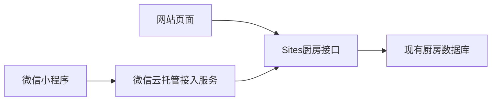

# 微信小程序需求与方案

## 已确认的需求

保留两人厨房Sites网站，同时增加原生微信小程序。网站和小程序共用菜单、冰箱、晚餐评分、采购清单和历史记录。沿用共同口令登录，身份按钮为“男生”和“女生”，允许切换身份。

用户已确认本次方案，并在本次实现完成后明确要求助手提交代码。本次在当前分支创建提交，远程推送及微信发布另外处理。用户明确允许替换微信云托管 springboot-5wzu 服务中的旧业务，不表示删除现有Sites厨房数据。

## 环境

- 小程序AppID：wxd3ad251e8ea72453。
- 微信云托管环境：prod-d0g3sabmk422d992f。
- 微信云托管服务：springboot-5wzu。
- 数据源：https://our-kitchen-oct09.berryokapi.chatgpt.site。

用户截图确认环境是微信云托管，不是微信云函数环境。实现使用 wx.cloud.callContainer，不使用 wx.cloud.callFunction。

## 处理流程

小程序调用云托管服务里的固定三个接口：口令登录、读取厨房、修改厨房。云托管服务只转发请求和接口结果，不判断分数，不另存库存，不接受客户端填写转发网址。

### 登录

小程序把共同口令和选择的身份发到云托管，云托管经HTTPS交给Sites。成功后只把登录票据保存在当前手机，不保存共同口令。票据有效期、厨房隔离和评分身份由原网站接口处理。

相同共同口令在两个入口中对应同一份厨房数据。知道口令的人能够选择任一身份，不能用它证明现实中的情侣关系。

### 四个入口

- 今晚吃什么：默认一荤两素，随机或手选，0到5分，至少7分入选，换菜重新评分，采购清单生成，最近30轮历史。
- 冰箱：添加和移除主要食材，常用食材快捷添加。
- 采购清单：添加、移除、标记已买，确认加入冰箱。
- 菜单：搜索、分类筛选、食材已齐筛选、新增、编辑、不再推荐、恢复、永久删除。

云端同步在前台约每8秒一次，下拉可以立即刷新。进入后台停止轮询。响应按版本排序，旧结果不能覆盖新结果。实际写入沿用原接口的版本检查，不依赖某个容器的内存。

## 不处理的范围

不迁移厨房数据库，不使用云托管自动开通的MySQL，不增加微信手机号或微信账号绑定，不修改原来的评分和配菜规则。

## 已知边界

- 云托管到Sites的网络是否稳定，要在真实云托管环境验证。本地转发成功不等于云托管部署成功。
- 云托管实例会共用对外出口。原网站登录按网络地址限流，可能使同一出口共用每15分钟20次的登录限制；本项目两人日常使用保留这个限制，没有放宽验证。
- 一个共有口令对应一个厨房，输错口令会打开另一份厨房；没有口令找回功能。
- 当前代码不依赖微信AppSecret，不应把数据库密码或AppSecret放进小程序。

## 发布授权与阻碍

本次只增加小程序及云托管代码，原Sites网站无需重新发布。微信云托管控制台受到浏览器安全策略阻止，无法由助手查看或操作，也不能通过其他浏览器绕过。部署包完成后需要用户在控制台上传。微信开发者工具在已检查的应用目录中未找到，小程序正式发布还需上传、审核及平台允许；不能承诺审核通过。
